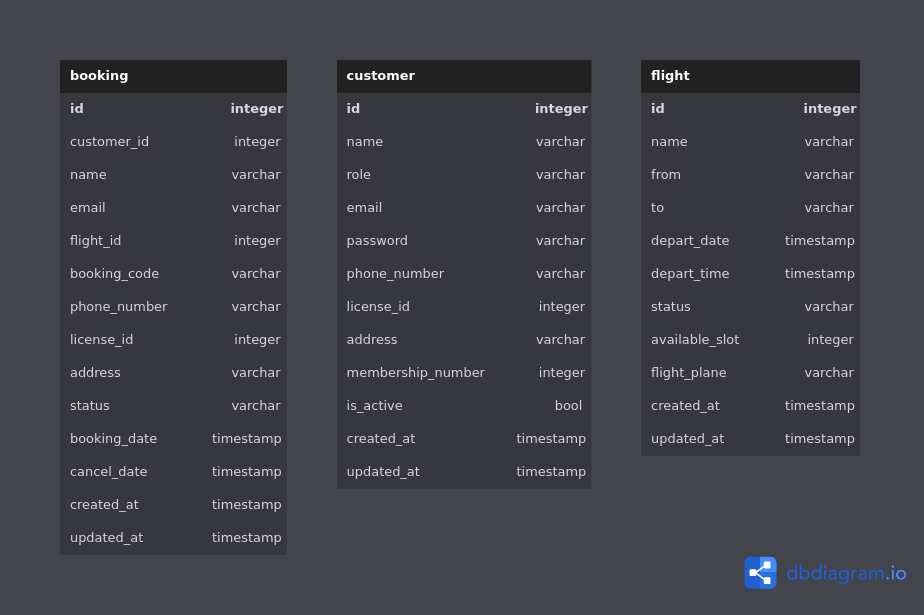

# Golang Mock Project - Booking Flight System

This project is an example for use Golang write GraphQl + gRPC , microservice pattern

# This project has
- Client - Service : It's serve HTTP server with GraphQL
- Customer - Service : It's customer server with gRPC
- Flight - Service : It's flight server with gRPC
- Booking - Service : It's booking server with gRPC

# Techstack
- Gin framework : Handle request , response , middleware
- Ent . : ORM framework help Go communicate with database
- Gqlgen : generate GraphQL code
- Protoc-gen-go-grpc : Generate Golang code from protoc file
- Database : Postgresql


## Get Started

### Local Development
#### Software & Hardware requirements
- You must install the [Docker Desktop](https://www.docker.com/products/docker-desktop/) and Docker Compose on your local desktop to spin up all systems
- Change your Docker Desktop resource capacity to at least 8GB RAM and 4 vCPU

#### Run Application by Docker-Compose

- Start docker and run docker-compose by use your terminal

  ```bash
  docker-compose up
  ```

- Clean up everything created by docker-compose by use your terminal

  ```bash
  docker-compose down
  docker volume prune -y
  ```

- The docker-compose will bootstrap a required database to working with source code includes:
    - Database: `booking_system`
    - username: `huongbui`
    - password: `huongbui`
#### How to test

- You can access
    - Backend via http://localhost:8000 (GraphQL Playground) and http://localhost:8000/graphql (GraphQL Server)
    - User with role ADMIN will be created while running docker-compose
      - You can use account with role Admin to fully access
        - username: `admin`
        - password: `admin123`
#### Entity Relationship Diagram



Code follow rule [Golang-boilerplate-Techvify](https://github.com/ducmeit1/golang-boilerplate) and  [Go-micro-training](https://github.com/ducmeit1/go-micro-training)

